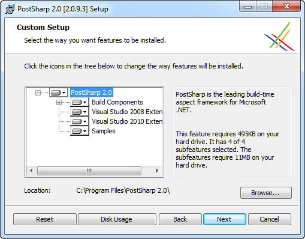
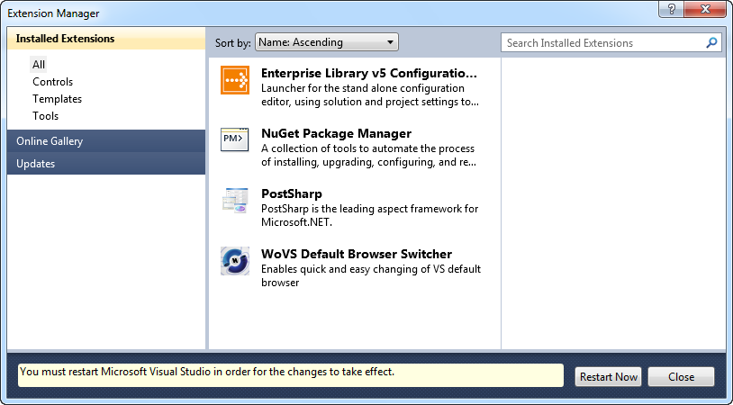
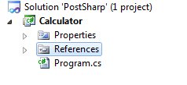
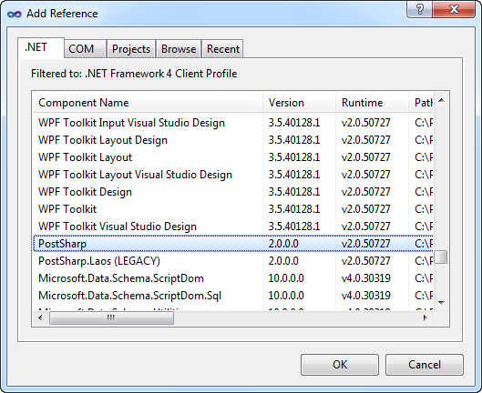
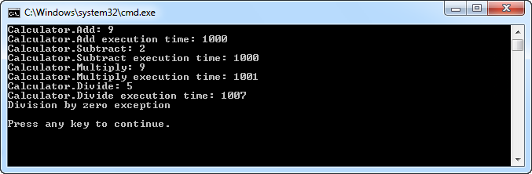

# PostSharp

## Introduction

PostSharp is an [aspect-oriented programming](http://en.wikipedia.org/wiki/Aspect-oriented_programming) (AOP) framework that allows you to encapsulate repeating code patterns as .NET attributes. These attributes are referred to as aspects. Using the power of attributes you can apply them to multiple parts of your code.

This post demonstrates the value of these aspects by encapsulating a couple of common cross-cutting concerns, such as:

- Tracing Method Execution
- Logging
- Exception Handling

Let's get started...

## Getting Started

Before you can start coding, you need to download the free community edition of PostSharp.

1. Go to the [SharpCrafters](http://www.sharpcrafters.com) site where PostSharp is hosted.
2. [Sign in](http://www.sharpcrafters.com/SignIn.aspx?ReturnUrl=http%3A//www.sharpcrafters.com/) using your OpenID (Google, Yahoo, Wordpress...) or [sign up with SharpCrafters](https://www.myopenid.com/signup?affiliate_id=51326) if you don't have an OpenID.
3. Once signed in, go to the [download page](http://www.sharpcrafters.com/postsharp/download) and download the latest version.

At the time of writing, the latest version was 2.0 Update 5 (2.0.9.3). The download includes both the community and professional editions. During the first 45 days, the professional edition is active by default. Afterwards it will revert to the community edition which contains fewer features. The code shown in this post only uses features available in the community edition.

Start the setup application once the download has completed. A setup wizard will guide you through the installation process. PostSharp works with Visual Studio 2008 and 2010.



After the installation has completed PostSharp will have installed itself as a Visual Studio extension.



## Demo Application

Let's create a simple demo application so that we can demonstrate the power of PostSharp. Startup Visual Studio and create a new blank solution called PostSharp. Next add a console application called Calculator to the solution.



Add a reference to the PostSharp.dll assembly.



Add a new interface ICalculator to the project and add the following code to it:

```csharp
public interface ICalculator
{
    int Add(int x, int y);
    int Subtract(int x, int y);
    int Multiply(int x, int y);
    double Divide(int x, int y);
}
```

Let's create a simple calculator class by implementing this interface. Apart from performing the necessary calculations, we also want to measure the execution time and log the result of each method. For the Divide method we also require some exception handling for catching division by zero exceptions.

```csharp
public class Calculator : ICalculator
{
    public int Add(int x, int y)
    {
        var stopWatch = new Stopwatch();
        stopWatch.Start();

        // Simulate a lengthy operation
        Thread.Sleep(1000);

        var result = x + y;

        // Log the result to the console window
        Console.WriteLine(String.Format("Calculator.Add: {0}", result));

        // Log the execution time to the console window
        stopWatch.Stop();
        Console.WriteLine(
            String.Format("Calculator.Add execution time: {0}",
                            stopWatch.ElapsedMilliseconds));

        return result;
    }

    // ...etc.

    public double Divide(int x, int y)
    {
        try
        {
            var stopWatch = new Stopwatch();
            stopWatch.Start();

            // Simulate a lengthy operation
            Thread.Sleep(1000);

            var result = x/y;

            // Log the result to the console window
            Console.WriteLine(String.Format("Calculator.Divide: {0}", result));

            // Log the execution time to the console window
            stopWatch.Stop();
            Console.WriteLine(
                String.Format("Calculator.Divide execution time: {0}",
                                stopWatch.ElapsedMilliseconds));

            return result;
        }
        catch(DivideByZeroException)
        {
            // Gulp
            Console.WriteLine("Division by zero exception");
            return 0;
        }
    }
}
```

The Calculator class logs the result by writing it to the console window. The execution time is calculated using the [Stopwatch class](http://msdn.microsoft.com/en-us/library/system.diagnostics.stopwatch.aspx). The total execution time is also written to the console window. The Subtract and Multiply methods are similar to the Add method. For brevity's sake I've omitted them in the preceding code fragment. The Divide method contains an additional try/catch block to catch division by zero exceptions. For this sample the exception is ignored and a message is written to the console window.

Let's perform some calculations.

```csharp
class Program
{
    static void Main()
    {
        ICalculator calculator = new Calculator();

        calculator.Add(2, 7);
        calculator.Subtract(10, 8);
        calculator.Multiply(3, 3);
        calculator.Divide(20, 4);
        calculator.Divide(20, 0);

        Console.WriteLine();
        Console.WriteLine("Press any key to continue.");
        Console.ReadKey();
    }
}
```

Execute the application by hitting F5. Your result should resemble the following screenshot.



## Tracing Method Execution

As you can see the Calculator class contains a lot of repetitive code. Let's remove some of this duplicate code by encapsulating the tracing of method execution in a PostSharp aspect.

Add a new class called TraceAttribute to the project and add the following code to it.

```csharp
[Serializable]
public sealed class TraceAttribute : OnMethodBoundaryAspect
{
    public override void OnEntry(MethodExecutionArgs args)
    {
        base.OnEntry(args);

        var stopwatch = new Stopwatch();
        stopwatch.Start();

        args.MethodExecutionTag = stopwatch;
    }

    public override void OnExit(MethodExecutionArgs args)
    {
        base.OnExit(args);

        var stopwatch = (Stopwatch) args.MethodExecutionTag;

        stopwatch.Stop();
        Console.WriteLine(
            String.Format("{0}.{1} execution time: {2}",
                            args.Method.DeclaringType.Name,
                            args.Method.Name,
                            stopwatch.ElapsedMilliseconds));
    }
}
```

The TraceAttribute descends from the OnMethodBoundaryAspect class type provided by the PostSharp framework. When you create an aspect that descends from the OnMethodBoundaryAspect class and apply it to a method it will insert a piece of code before and after the body of the method to which it is applied.

The OnEntry() method contains the code that will be executed before the code contained within the body of the method is run. The OnExit() method contains the code that will be executed after the method has executed, but right before it returns and goes out of scope.

The TraceAttribute create a new Stopwatch instance, starts it and uses the MethodExecutionTag property of the MethodExecutionArgs parameter to pass the Stopwatch instance to the OnExit method. The OnExit method extracts the Stopwatch instance, stops it and writes the total execution time to the console window.

Now you can rewrite the calculator class as follows:

```csharp
public class Calculator : ICalculator
{
    [Trace]
    public int Add(int x, int y)
    {
        // Simulate a lengthy operation
        Thread.Sleep(1000);

        var result = x + y;

        // Log the result to the console window
        Console.WriteLine(String.Format("Calculator.Add: {0}", result));

        return result;
    }

    //...etc.
}
```

The methods of the calculator class no longer contain any code related to tracing the execution time. The methods are now decorated with the Trace attribute (or aspect). Hit F5 to run the application and you'll notice that the output is exactly the same.

## Logging

We can rewrite the logging of the calculations in exactly the same way. Add a new class called LogAttribute to the project and add the following code to it:

```csharp
[Serializable]
public class LogAttribute : OnMethodBoundaryAspect
{
    public override void OnExit(MethodExecutionArgs args)
    {
        base.OnExit(args);

        Console.WriteLine(String.Format("{0}.{1}: {2}",
            args.Method.DeclaringType.Name,
            args.Method.Name,
            args.ReturnValue));
    }
}
```

The code in the calculator class can now be reduced even further.

```csharp
public class Calculator : ICalculator
{
    [Log]
    [Trace]
    public int Add(int x, int y)
    {
        // Simulate a lengthy operation
        Thread.Sleep(1000);

        var result = x + y;

        return result;
    }

    //...etc.
}
```

## Exception Handling

Last but not least, let's handle the division by zero exception for the Divide method. Add a class called HandleDivisionByZeroAttribute which contains the following code:

```csharp
[Serializable]
public class HandleDivisionByZeroAttribute : OnExceptionAspect
{
    public override Type GetExceptionType(MethodBase targetMethod)
    {
        return typeof (DivideByZeroException);
    }

    public override void OnException(MethodExecutionArgs args)
    {
        base.OnException(args);

        Console.WriteLine("Division by zero exception");
        args.ReturnValue = 0;
        args.FlowBehavior = FlowBehavior.Continue;
    }
}
```

This aspect descends from the OnExceptionAspect class provided by the PostSharp framework. This aspect, when applied to a method, defines an exception handler (try/catch block) around the whole method.

Use the GetExceptionType() method to specify the exception type to handle. In the overriden OnException method you can specify how to handle the exception. In this case we write a message to the console window and inform the application that it should continue running (FlowBehavior.Continue).

## PostSharp Calculator

Voila, the Calculator class is finished. Tracing method execution, logging and exception handling will now be handled by PostSharp aspects. The Calculator class now looks like this:

```csharp
public class Calculator : ICalculator
{
    [Log]
    [Trace]
    public int Add(int x, int y)
    {
        return x + y;
    }

    [Trace]
    public int Subtract(int x, int y)
    {
        return x - y;
    }

    [Log]
    [Trace]
    public int Multiply(int x, int y)
    {
        return x * y;
    }

    [Log]
    [Trace]
    [HandleDivisionByZeroAttribute]
    public double Divide(int x, int y)
    {
        return x / y;
    }
}
```

If you want to learn more about PostSharp be sure to check out the [SharpCrafters](http://www.sharpcrafters.com/) site.
